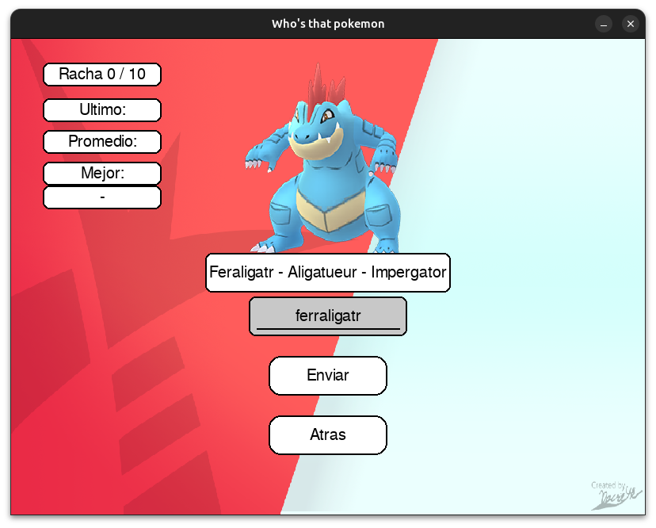

# ¿Quien es ese pokemon?

## Requisitos:
### Windows / Linux: pip install -r requirements.txt

## Inicio del juego

El juego inicia con una pantalla en donde el jugador puede seleccionar la dificultad y generacion/es con las que quiere jugar. En cuyo caso el usuario no seleccione alguno de los mismos, se asume que se desea jugar con todos (es decir, todas las dificultades/generaciones).
Adicionalmente, un menu en la parte superior derecha ofrece la posibilidad de configurar el sonido del juego si es que el jugador prefiere otra pista (todas originales de los juegos), aumentar o reducir el volumen, o pausar la misma.

<figure>
  <figcaption>Juego iniciado con configuraciones predeterminadas</figcaption>
  
</figure>

<figure>
  <figcaption>Dificultad Facil y generaciones 1 y 2 seleccionadas</figcaption>
  
</figure>

## Juego Principal

Al usuario se le presenta la silueta de un pokemon y una caja de texto donde debe escribir el que cree es el nombre del mismo, y, adivine o no, se le va a presentar el pokemon revelado con sus nombres en varios idiomas. Si es que adivina correctamente pasa al siguiente, pero si falla vuelve al menu. Dentro de la partida ademas se puede ver cuanto se tardó en adivinar el ultimo pokemon, el adivinado mas rapido (con el nombre del mismo) y cuanto se tardó en promedio en adivinar esta partida.

<figure>
  <figcaption>Inicio del juego principal</figcaption>
  
</figure>

<figure>
  <figcaption>Pokemon adivinado</figcaption>
  
</figure>

Al ganar aparece una imagen diciendo lo mismo, y se regresa al inicio.

<figure>
  <figcaption>Juego terminado</figcaption>
  
</figure>

### Video del Juego
- https://youtu.be/QlWORAMBiMY
